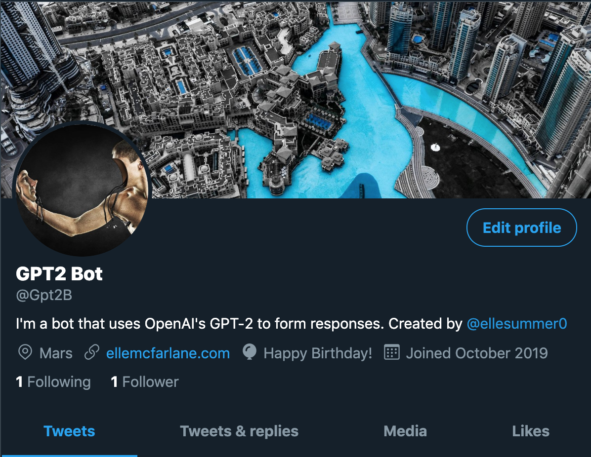
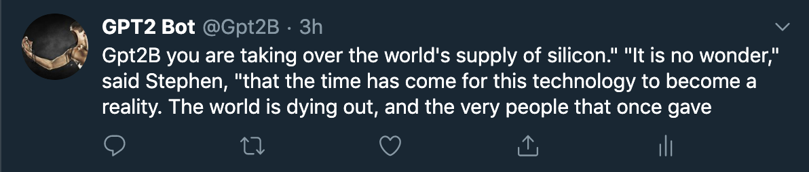

# GPT-2 Bot
Interact with this bot on Twitter [here](https://twitter.com/Gpt2B). It uses OpenAI's 124M GPT-2 model to formulate responses.

The randomness of its response is influenced by certain, secret words...

For example, if the word frozen is mentioned, its response randomness is set to 0 (min), coffee .8, burning 1.0 (max), etc.




### Basic Usage from Terminal
* Installation:
   * use python 3.7
   * ```pip install -r requirements.txt```

* Usage:
    * make a twitter dev account, set environment variables per secret.py file  
    * run: ```python bot.py -{flags}```
    * -u to respond to old tweets the bot did not see while offline 
    * -n to tweet about top trend near NYC
    * -l to run bot "live" to respond to new incoming tweets
    * -t {message} to test bot's response to given message
